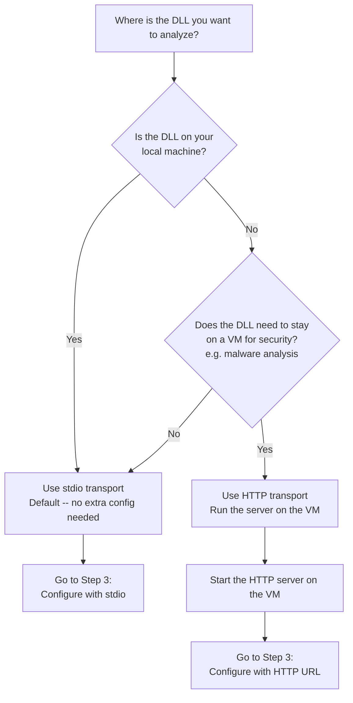

<p align="center">
  
</p>

<p align="center">
  <a href="LICENSE"></a>
  <a href="https://github.com/cervonwong/ILSpy-MCP/stargazers"></a>
  <a href="https://github.com/cervonwong/ILSpy-MCP/releases"></a>
  
  
  
  
</p>

# ILSpy MCP Server

> **Beta:** This project is under active development. Expect breaking changes from day to day.

MCP server that gives AI assistants .NET decompilation and static analysis capabilities via [ILSpy](https://github.com/icsharpcode/ILSpy). Works with any MCP client (Claude Code, Codex, Opencode, Cursor, and more) on Windows, Linux, and macOS.

Ask your favourite AI Chatbot to explain how to use ILSpy MCP Server: [](https://chatgpt.com/?q=Read%20https%3A%2F%2Fgithub.com%2Fcervonwong%2FILSpy-MCP%2Fblob%2Fmain%2FREADME.md)
[](https://claude.ai/new?q=Read%20https%3A%2F%2Fgithub.com%2Fcervonwong%2FILSpy-MCP%2Fblob%2Fmain%2FREADME.md)

---

- [What is this?](#what-is-this)
- [Features](#features)
- [Supported MCP clients](#supported-mcp-clients)
- [Quick start](#quick-start)
  - [Step 1: Get the binary](#step-1-get-the-binary)
  - [Step 2: Choose your transport](#step-2-choose-your-transport)
  - [Step 3: Configure your MCP client](#step-3-configure-your-mcp-client)
- [How it works](#how-it-works)
- [Usage examples](#usage-examples)
- [Tool reference](#tool-reference)
  - [Decompilation](#decompilation)
  - [IL disassembly](#il-disassembly)
  - [Type analysis](#type-analysis)
  - [Cross-references](#cross-references)
  - [Assembly inspection](#assembly-inspection)
  - [Search](#search)
  - [Cross-assembly](#cross-assembly)
  - [Bulk operations](#bulk-operations)
- [HTTP server reference](#http-server-reference)
- [Configuration reference](#configuration-reference)
- [Comparison with other servers](#comparison-with-other-net-decompilation-mcp-servers)
- [Acknowledgements](#acknowledgements)
- [License](#license)

---

## What is this?

ILSpy MCP Server wraps [ICSharpCode.Decompiler](https://github.com/icsharpcode/ILSpy/tree/master/ICSharpCode.Decompiler) (the engine behind ILSpy) as a [Model Context Protocol](https://modelcontextprotocol.io/) (MCP) server. Your AI assistant calls the decompiler directly and gets back structured results it can reason over. No GUI needed.

## Features

**27 tools** across 8 categories:

- **Decompilation** -- types, methods, and entire namespaces to C# source
- **IL disassembly** -- raw CIL/IL at the type or method level
- **Type analysis** -- list types, inspect members, trace hierarchies, find implementors, discover extension methods
- **Cross-references** -- usages, dependencies, instantiation sites
- **Assembly inspection** -- metadata, custom attributes (assembly/type/member), embedded resources, compiler-generated types
- **Search** -- string literals and numeric constants in IL bytecode
- **Cross-assembly** -- resolve types across assemblies, load entire directories
- **Bulk operations** -- export assemblies as complete C# projects

## Supported MCP clients

Works with any MCP-compatible client. We recommend **Claude Code**.

Amazon Q Developer CLI, Augment Code, Claude, **Claude Code** (recommended), Cline, Codex, Copilot CLI, Crush, Cursor, Gemini CLI, Kilo Code, Kiro, LM Studio, Opencode, Qodo Gen, Qwen Coder, Roo Code, Trae, VS Code, VS Code Insiders, Warp, Windsurf, Zed, and more.

## Quick start

### Step 1: Get the binary

Choose how you want to install:

<details>
<summary><b>Option A: Pre-built Binary (Recommended -- no .NET required)</b></summary>

1. Download the latest release for your platform from [Releases](https://github.com/cervonwong/ILSpy-MCP/releases):

   | Platform | File |
   |----------|------|
   | Windows x64 | `ilspy-mcp-win-x64.zip` |
   | Linux x64 | `ilspy-mcp-linux-x64.tar.gz` |
   | Linux ARM64 | `ilspy-mcp-linux-arm64.tar.gz` |
   | macOS x64 | `ilspy-mcp-osx-x64.zip` |
   | macOS ARM64 | `ilspy-mcp-osx-arm64.zip` |

   Each release includes SHA256 checksums (`.sha256` files) for verifying download integrity.

2. Extract the archive:

   **Windows (PowerShell):**
   ```powershell
   Expand-Archive ilspy-mcp-win-x64.zip -DestinationPath ilspy-mcp
   ```

   **Linux:**
   ```bash
   tar -xzf ilspy-mcp-linux-x64.tar.gz -C ilspy-mcp
   chmod +x ilspy-mcp/ILSpy.Mcp
   ```

   **macOS:**
   ```bash
   unzip ilspy-mcp-osx-arm64.zip -d ilspy-mcp
   chmod +x ilspy-mcp/ILSpy.Mcp
   ```

</details>

<details>
<summary><b>Option B: Build from Source</b></summary>

1. Clone the repository:
   ```bash
   git clone https://github.com/cervonwong/ILSpy-MCP.git
   cd ILSpy-Mcp
   ```

2. Build the project:
   ```bash
   dotnet build
   ```

3. The binary is at `src/ILSpy.Mcp/bin/Debug/net10.0/ILSpy.Mcp`. Use this path in the steps below.

</details>

### Step 2: Choose your transport

Use the flowchart below to decide how to set up the server:



**stdio (default)** -- The MCP client launches the server automatically. No extra setup. Use this if the DLLs are on your local machine.

**HTTP** -- You start the server manually on a remote machine. Use this for analysis VMs, build servers, or Docker containers. See [HTTP Server Reference](#http-server-reference) for startup commands and configuration.

### Step 3: Configure your MCP client

Pick your client and follow the steps.

<details>
<summary><b>Claude Code</b></summary>

**stdio (local):**
```bash
claude mcp add ilspy-mcp --command "/path/to/ilspy-mcp/ILSpy.Mcp" --scope user
```

**HTTP (remote):**
```bash
claude mcp add ilspy-mcp --transport http http://<server>:3001/mcp --scope user
```

Restart Claude Code. The tools are now available.

</details>

<details>
<summary><b>Cursor</b></summary>

Add to your MCP settings JSON:

**stdio (local):**
```json
{
  "mcpServers": {
    "ilspy-mcp": {
      "command": "/path/to/ilspy-mcp/ILSpy.Mcp",
      "args": []
    }
  }
}
```

**HTTP (remote):**
```json
{
  "mcpServers": {
    "ilspy-mcp": {
      "type": "http",
      "url": "http://<server>:3001/mcp"
    }
  }
}
```

Restart Cursor.

</details>

<details>
<summary><b>Claude Desktop</b></summary>

Add to `claude_desktop_config.json`:

**stdio (local):**
```json
{
  "mcpServers": {
    "ilspy-mcp": {
      "command": "/path/to/ilspy-mcp/ILSpy.Mcp",
      "args": []
    }
  }
}
```

**HTTP (remote):**
```json
{
  "mcpServers": {
    "ilspy-mcp": {
      "type": "http",
      "url": "http://<server>:3001/mcp"
    }
  }
}
```

Restart Claude Desktop.

</details>

<details>
<summary><b>Other MCP Clients</b></summary>

For any MCP-compatible client, configure it with:

- **stdio:** Point to the `ILSpy.Mcp` binary as the command
- **HTTP:** Use `http://<server>:3001/mcp` as the endpoint URL

Consult your client's documentation for how to add MCP servers.

</details>

## Uninstall

1. **Remove the MCP client registration:**

   <details>
   <summary><b>Claude Code</b></summary>

   ```bash
   claude mcp remove ilspy-mcp --scope user
   ```

   </details>

   <details>
   <summary><b>Cursor / Claude Desktop / others</b></summary>

   Delete the `"ilspy-mcp"` entry from your client's MCP settings JSON (`claude_desktop_config.json`, Cursor MCP settings, etc.) and restart the client.

   </details>

2. **Delete the extracted directory:**

   **Windows (PowerShell):**
   ```powershell
   Remove-Item -Recurse -Force C:\path\to\ilspy-mcp
   ```

   **Linux / macOS:**
   ```bash
   rm -rf /path/to/ilspy-mcp
   ```

3. **(Built from source only)** Delete the cloned repo:
   ```bash
   rm -rf ILSpy-MCP
   ```

The server stores no config, cache, or state outside its own directory, so no other cleanup is needed.

## How it works

You don't interact with ILSpy MCP directly. Your MCP client (Claude Code, Cursor, etc.) launches and communicates with it automatically in the background.

To analyze a .NET assembly, mention the full path to the DLL in your chat. The AI assistant picks the right tools automatically.

## Usage examples

Replace the paths below with actual DLL paths on your machine:

- **Decompile a type** -- "Decompile the String class from `C:\Program Files\dotnet\shared\Microsoft.NETCore.App\10.0.0\System.Runtime.dll`"
- **List all types** -- "List all types in `C:\Users\me\projects\MyApp\bin\Debug\net10.0\MyLibrary.dll`"
- **Find a method** -- "Find the CalculateTotal method in `D:\libs\Calculator.dll`"
- **Decompile a constructor** -- "Decompile the .ctor constructor of UserService in `C:\repos\MyApp\bin\Debug\net10.0\MyApp.dll`"
- **Analyze type hierarchy** -- "Show me the type hierarchy for ProductService in `C:\repos\ECommerce\bin\Release\net10.0\ECommerce.dll`"
- **Search members** -- "Search for members containing 'Authenticate' in `C:\repos\AuthService\bin\Debug\net10.0\Auth.dll`"
- **View IL disassembly** -- "Show me the raw IL for the Serialize method in `C:\repos\MyApp\bin\Debug\net10.0\MyApp.dll`"
- **Find all usages** -- "Where is the Save method of IRepository called in `C:\repos\MyApp\bin\Debug\net10.0\MyApp.dll`?"
- **Find implementors** -- "What types implement ILogger in `C:\Program Files\dotnet\shared\Microsoft.NETCore.App\10.0.0\Microsoft.Extensions.Logging.dll`?"
- **Trace dependencies** -- "What does the ProcessOrder method in OrderService depend on in `C:\repos\ECommerce\bin\Release\net10.0\ECommerce.dll`?"
- **Find instantiations** -- "Where is HttpClient instantiated in `C:\repos\MyApp\bin\Debug\net10.0\MyApp.dll`?"
- **Inspect assembly metadata** -- "What target framework and PE bitness does `C:\repos\MyApp\bin\Release\net10.0\MyApp.dll` target?"
- **Read custom attributes** -- "What custom attributes are on the OrderService class in `C:\repos\ECommerce\bin\Debug\net10.0\ECommerce.dll`?"
- **Extract embedded resources** -- "List all embedded resources in `C:\repos\MyApp\bin\Debug\net10.0\MyApp.dll` and extract the SQL migration script"
- **Find compiler-generated types** -- "Show me the async state machines and closures in `C:\repos\MyApp\bin\Debug\net10.0\MyApp.dll`"
- **Export a project** -- "Export `C:\repos\MyApp\bin\Debug\net10.0\MyApp.dll` as a C# project to `C:\temp\MyApp-decompiled`"

## Tool reference

> **Pagination:** Tools that return lists (e.g., `list_namespace_types`,
> `find_*`, `search_*`) accept `maxResults` and `offset` parameters with
> sensible defaults and always include a trailing `[pagination:{...}]`
> footer reporting `total`, `returned`, `truncated`, and `nextOffset`.
> See [`docs/PAGINATION.md`](docs/PAGINATION.md) for the complete contract,
> including the hard ceiling and worked examples.

### Decompilation

#### `decompile_type`

Decompile a .NET type to C# source code with AI-analyzed insights about usage patterns.

| Parameter | Type | Required | Description |
|-----------|------|----------|-------------|
| `assemblyPath` | string | Yes | Path to the .NET assembly file |
| `typeName` | string | Yes | Full name of the type to decompile (e.g., `System.String`) |
| `query` | string | No | What specific information to look for (e.g., "method implementations", "property definitions") |

<details>
<summary>Example</summary>

**Input:**
```json
{
  "assemblyPath": "C:\\libs\\MyLibrary.dll",
  "typeName": "MyLibrary.Services.UserService",
  "query": "overall structure"
}
```

**Output (trimmed):**
```
using System;
using System.Threading.Tasks;

namespace MyLibrary.Services
{
    public class UserService : IUserService
    {
        private readonly IUserRepository _repository;

        public UserService(IUserRepository repository)
        {
            _repository = repository;
        }

        public async Task<User> GetByIdAsync(int id) { ... }
        public async Task<bool> DeleteAsync(int id) { ... }
        ...
    }
}
```

</details>

---

#### `decompile_method`

Decompile a specific method or constructor (`.ctor`/`.cctor`) to C# source code.

| Parameter | Type | Required | Description |
|-----------|------|----------|-------------|
| `assemblyPath` | string | Yes | Path to the .NET assembly file |
| `typeName` | string | Yes | Full name of the type containing the method |
| `methodName` | string | Yes | Name of the method to decompile |
| `query` | string | No | What aspect of the method to focus on (e.g., "algorithm logic", "error handling") |

<details>
<summary>Example</summary>

**Input:**
```json
{
  "assemblyPath": "C:\\libs\\MyLibrary.dll",
  "typeName": "MyLibrary.Services.UserService",
  "methodName": "GetByIdAsync"
}
```

**Output (trimmed):**
```
public async Task<User> GetByIdAsync(int id)
{
    if (id <= 0)
        throw new ArgumentOutOfRangeException(nameof(id));

    var user = await _repository.FindByIdAsync(id);
    if (user == null)
        throw new UserNotFoundException(id);

    return user;
}
```

</details>

---

#### `list_namespace_types`

List all types in a namespace with full signatures, member counts, and public method signatures. Returns a summary -- use `decompile_type` to get full source for individual types.

| Parameter | Type | Required | Description |
|-----------|------|----------|-------------|
| `assemblyPath` | string | Yes | Path to the .NET assembly file |
| `namespaceName` | string | Yes | Full namespace name (e.g., `System.Collections.Generic`) |
| `maxResults` | int | No | Maximum number of results to return (default: 100) |
| `offset` | int | No | Number of results to skip for pagination (default: 0) |

<details>
<summary>Example</summary>

**Input:**
```json
{
  "assemblyPath": "C:\\libs\\MyLibrary.dll",
  "namespaceName": "MyLibrary.Services"
}
```

**Output (trimmed):**
```
Namespace: MyLibrary.Services
Types: 5

--- Interfaces ---

IUserService (Interface, 3 members)
  Task<User> GetByIdAsync(int id)
  Task<IEnumerable<User>> GetAllAsync()
  Task<bool> DeleteAsync(int id)

--- Classes ---

UserService : IUserService (Class, 4 members)
  .ctor(IUserRepository repository)
  Task<User> GetByIdAsync(int id)
  Task<IEnumerable<User>> GetAllAsync()
  Task<bool> DeleteAsync(int id)

OrderService : IOrderService (Class, 3 members)
  ...
```

</details>

---

### IL disassembly

#### `disassemble_type`

Get raw CIL/IL disassembly of a .NET type showing method signatures, fields, properties, and events in IL format.

| Parameter | Type | Required | Description |
|-----------|------|----------|-------------|
| `assemblyPath` | string | Yes | Path to the .NET assembly file |
| `typeName` | string | Yes | Full name of the type (e.g., `System.String`) |
| `showTokens` | bool | No | Show metadata token numbers (e.g., `/* 06000001 */`) |
| `resolveDeep` | bool | No | When true, expand full type signatures for parameters and generics inline (larger output). Default false preserves abbreviated form. |

<details>
<summary>Example</summary>

**Input:**
```json
{
  "assemblyPath": "C:\\libs\\MyLibrary.dll",
  "typeName": "MyLibrary.Models.User"
}
```

**Output (trimmed):**
```
.class public auto ansi beforefieldinit MyLibrary.Models.User
    extends [System.Runtime]System.Object
{
    .field private string '<Name>k__BackingField'

    .property instance string Name()
    {
        .get instance string MyLibrary.Models.User::get_Name()
        .set instance void MyLibrary.Models.User::set_Name(string)
    }

    .method public hidebysig specialname
        instance string get_Name () cil managed
    {
        ...
    }
}
```

</details>

---

#### `disassemble_method`

Get raw CIL/IL disassembly of a specific method with opcodes, labels, and stack information.

| Parameter | Type | Required | Description |
|-----------|------|----------|-------------|
| `assemblyPath` | string | Yes | Path to the .NET assembly file |
| `typeName` | string | Yes | Full name of the type containing the method |
| `methodName` | string | Yes | Name of the method to disassemble |
| `showBytes` | bool | No | Show raw opcode byte sequences |
| `showTokens` | bool | No | Show metadata token numbers (e.g., `/* 06000001 */`) |
| `resolveDeep` | bool | No | When true, expand full type signatures for parameters and generics inline (larger output). Default false preserves abbreviated form. |

<details>
<summary>Example</summary>

**Input:**
```json
{
  "assemblyPath": "C:\\libs\\MyLibrary.dll",
  "typeName": "MyLibrary.Services.UserService",
  "methodName": "GetByIdAsync"
}
```

**Output (trimmed):**
```
.method public hidebysig newslot virtual
    instance class [System.Runtime]System.Threading.Tasks.Task`1<class MyLibrary.Models.User>
    GetByIdAsync (int32 id) cil managed
{
    .maxstack 2
    .locals init (
        [0] class MyLibrary.Models.User user
    )

    IL_0000: ldarg.1
    IL_0001: ldc.i4.0
    IL_0002: bgt.s IL_000a
    IL_0004: ldstr "id"
    IL_0009: newobj instance void [System.Runtime]System.ArgumentOutOfRangeException::.ctor(string)
    IL_000e: throw
    ...
}
```

</details>

---

### Type analysis

#### `list_assembly_types`

List all types in an assembly, organized by namespace. Start here when exploring an unfamiliar library.

| Parameter | Type | Required | Description |
|-----------|------|----------|-------------|
| `assemblyPath` | string | Yes | Path to the .NET assembly file |
| `namespaceFilter` | string | No | Filter types by namespace (case-insensitive) |

<details>
<summary>Example</summary>

**Input:**
```json
{
  "assemblyPath": "C:\\libs\\MyLibrary.dll",
  "namespaceFilter": "MyLibrary.Services"
}
```

**Output (trimmed):**
```
Assembly: MyLibrary
Types in namespace 'MyLibrary.Services': 5

  MyLibrary.Services.IUserService (Interface)
  MyLibrary.Services.UserService (Class)
  MyLibrary.Services.IOrderService (Interface)
  MyLibrary.Services.OrderService (Class)
  MyLibrary.Services.ServiceException (Class)
```

</details>

---

#### `get_type_members`

Get the complete API surface of a type (constructors, methods, properties, fields, events) without implementation details.

| Parameter | Type | Required | Description |
|-----------|------|----------|-------------|
| `assemblyPath` | string | Yes | Path to the .NET assembly file |
| `typeName` | string | Yes | Full name of the type to inspect |

<details>
<summary>Example</summary>

**Input:**
```json
{
  "assemblyPath": "C:\\libs\\MyLibrary.dll",
  "typeName": "MyLibrary.Services.UserService"
}
```

**Output (trimmed):**
```
Type: MyLibrary.Services.UserService (Class)
Base: System.Object
Implements: MyLibrary.Services.IUserService

Constructors:
  .ctor(IUserRepository repository)

Methods:
  Task<User> GetByIdAsync(int id)
  Task<IEnumerable<User>> GetAllAsync()
  Task<bool> DeleteAsync(int id)

Properties:
  (none)

Fields:
  IUserRepository _repository (private)
```

</details>

---

#### `find_type_hierarchy`

Find inheritance relationships: base classes, implemented interfaces, and derived types.

| Parameter | Type | Required | Description |
|-----------|------|----------|-------------|
| `assemblyPath` | string | Yes | Path to the .NET assembly file |
| `typeName` | string | Yes | Full name of the type to analyze |

<details>
<summary>Example</summary>

**Input:**
```json
{
  "assemblyPath": "C:\\libs\\MyLibrary.dll",
  "typeName": "MyLibrary.Services.UserService"
}
```

**Output (trimmed):**
```
Type: MyLibrary.Services.UserService

Base types:
  System.Object

Implements:
  MyLibrary.Services.IUserService

Derived types:
  MyLibrary.Services.CachedUserService
```

</details>

---

#### `find_implementors`

Find all types implementing a given interface or extending a given base class within an assembly.

| Parameter | Type | Required | Description |
|-----------|------|----------|-------------|
| `assemblyPath` | string | Yes | Path to the .NET assembly file |
| `typeName` | string | Yes | Full name of the interface or base class (e.g., `MyNamespace.IMyInterface`) |

<details>
<summary>Example</summary>

**Input:**
```json
{
  "assemblyPath": "C:\\libs\\MyLibrary.dll",
  "typeName": "MyLibrary.Services.IUserService"
}
```

**Output (trimmed):**
```
Implementors of MyLibrary.Services.IUserService:

  MyLibrary.Services.UserService (implements)
  MyLibrary.Services.CachedUserService (implements)
```

</details>

---

#### `find_extension_methods`

Find extension methods available for a specific type.

| Parameter | Type | Required | Description |
|-----------|------|----------|-------------|
| `assemblyPath` | string | Yes | Path to the .NET assembly file |
| `targetTypeName` | string | Yes | Full name of the type to find extensions for (e.g., `System.String`) |

<details>
<summary>Example</summary>

**Input:**
```json
{
  "assemblyPath": "C:\\libs\\MyLibrary.dll",
  "targetTypeName": "System.String"
}
```

**Output (trimmed):**
```
Extension methods for System.String:

  MyLibrary.Extensions.StringExtensions.ToSlug(this string value) -> string
  MyLibrary.Extensions.StringExtensions.Truncate(this string value, int maxLength) -> string
```

</details>

---

#### `find_compiler_generated_types`

Find compiler-generated types (async state machines, display classes, closures, iterators) with their parent method and type context.

| Parameter | Type | Required | Description |
|-----------|------|----------|-------------|
| `assemblyPath` | string | Yes | Path to the .NET assembly file |

<details>
<summary>Example</summary>

**Input:**
```json
{
  "assemblyPath": "C:\\libs\\MyLibrary.dll"
}
```

**Output (trimmed):**
```
Compiler-generated types: 3

  <GetByIdAsync>d__1 (AsyncStateMachine)
    Parent method: UserService.GetByIdAsync
    Parent type: MyLibrary.Services.UserService

  <>c__DisplayClass2_0 (DisplayClass)
    Parent method: OrderService.ProcessOrderAsync
    Parent type: MyLibrary.Services.OrderService
  ...
```

</details>

---

#### `search_members_by_name`

Search for members (methods, properties, fields, events) by name across all types in an assembly.

| Parameter | Type | Required | Description |
|-----------|------|----------|-------------|
| `assemblyPath` | string | Yes | Path to the .NET assembly file |
| `searchTerm` | string | Yes | Name or partial name to search for (case-insensitive) |
| `memberKind` | string | No | Filter by member kind: `method`, `property`, `field`, `event` |

<details>
<summary>Example</summary>

**Input:**
```json
{
  "assemblyPath": "C:\\libs\\MyLibrary.dll",
  "searchTerm": "Async",
  "memberKind": "method"
}
```

**Output (trimmed):**
```
Members matching 'Async': 4

  MyLibrary.Services.UserService.GetByIdAsync(int) -> Task<User>
  MyLibrary.Services.UserService.GetAllAsync() -> Task<IEnumerable<User>>
  MyLibrary.Services.UserService.DeleteAsync(int) -> Task<bool>
  MyLibrary.Services.OrderService.ProcessOrderAsync(Order) -> Task<OrderResult>
```

</details>

---

### Cross-references

#### `find_usages`

Find all call sites, field accesses, and property usages of a specific member across an assembly.

| Parameter | Type | Required | Description |
|-----------|------|----------|-------------|
| `assemblyPath` | string | Yes | Path to the .NET assembly file |
| `typeName` | string | Yes | Full name of the type containing the member (e.g., `MyNamespace.MyClass`) |
| `memberName` | string | Yes | Name of the member (method, field, or property) |

<details>
<summary>Example</summary>

**Input:**
```json
{
  "assemblyPath": "C:\\libs\\MyLibrary.dll",
  "typeName": "MyLibrary.Data.IUserRepository",
  "memberName": "FindByIdAsync"
}
```

**Output (trimmed):**
```
Usages of MyLibrary.Data.IUserRepository.FindByIdAsync: 3

  MyLibrary.Services.UserService.GetByIdAsync (call)
  MyLibrary.Services.CachedUserService.GetByIdAsync (call)
  MyLibrary.Tests.UserServiceTests.GetById_ReturnsUser (call)
```

</details>

---

#### `find_dependencies`

Find all outward dependencies (method calls, field accesses, type references) of a type or specific method.

| Parameter | Type | Required | Description |
|-----------|------|----------|-------------|
| `assemblyPath` | string | Yes | Path to the .NET assembly file |
| `typeName` | string | Yes | Full name of the type to analyze (e.g., `MyNamespace.MyClass`) |
| `methodName` | string | No | Method name to narrow analysis to a specific method |

<details>
<summary>Example</summary>

**Input:**
```json
{
  "assemblyPath": "C:\\libs\\MyLibrary.dll",
  "typeName": "MyLibrary.Services.UserService",
  "methodName": "GetByIdAsync"
}
```

**Output (trimmed):**
```
Dependencies of MyLibrary.Services.UserService.GetByIdAsync: 4

  MyLibrary.Data.IUserRepository.FindByIdAsync (call)
  System.ArgumentOutOfRangeException..ctor (call)
  MyLibrary.Exceptions.UserNotFoundException..ctor (call)
  MyLibrary.Data.IUserRepository (type reference)
```

</details>

---

#### `find_instantiations`

Find all sites where a given type is instantiated (`newobj`) within an assembly.

| Parameter | Type | Required | Description |
|-----------|------|----------|-------------|
| `assemblyPath` | string | Yes | Path to the .NET assembly file |
| `typeName` | string | Yes | Full name of the type to find instantiations of (e.g., `MyNamespace.MyClass`) |

<details>
<summary>Example</summary>

**Input:**
```json
{
  "assemblyPath": "C:\\libs\\MyLibrary.dll",
  "typeName": "System.Net.Http.HttpClient"
}
```

**Output (trimmed):**
```
Instantiations of System.Net.Http.HttpClient: 2

  MyLibrary.Services.ApiClient..ctor (newobj)
  MyLibrary.Services.WebhookSender.SendAsync (newobj)
```

</details>

---

### Assembly inspection

#### `analyze_assembly`

Get an overview of an assembly's architecture: main namespaces, public types, and design patterns.

| Parameter | Type | Required | Description |
|-----------|------|----------|-------------|
| `assemblyPath` | string | Yes | Path to the .NET assembly file |
| `query` | string | No | What aspects to analyze (e.g., "architecture overview", "public API surface") |

<details>
<summary>Example</summary>

**Input:**
```json
{
  "assemblyPath": "C:\\libs\\MyLibrary.dll",
  "query": "architecture overview"
}
```

**Output (trimmed):**
```
Assembly: MyLibrary, Version=1.0.0.0
Types: 42 | Namespaces: 6

Top namespaces:
  MyLibrary.Services (12 types)
  MyLibrary.Models (10 types)
  MyLibrary.Data (8 types)
  MyLibrary.Extensions (5 types)
  ...
```

</details>

---

#### `get_assembly_metadata`

Get assembly metadata including target framework, runtime version, PE bitness, strong name, entry point, and all referenced assemblies.

| Parameter | Type | Required | Description |
|-----------|------|----------|-------------|
| `assemblyPath` | string | Yes | Path to the .NET assembly file |

<details>
<summary>Example</summary>

**Input:**
```json
{
  "assemblyPath": "C:\\libs\\MyLibrary.dll"
}
```

**Output (trimmed):**
```
Assembly: MyLibrary
Version: 1.0.0.0
Target Framework: .NETCoreApp,Version=v10.0
Runtime: v10.0.0
PE: PE32+ (64-bit)
Strong Name: No
Entry Point: None

Referenced Assemblies:
  System.Runtime, Version=10.0.0.0
  System.Collections, Version=10.0.0.0
  Microsoft.Extensions.DependencyInjection.Abstractions, Version=10.0.0.0
  ...
```

</details>

---

#### `get_assembly_attributes`

List all custom attributes declared on an assembly with their constructor arguments and named properties.

| Parameter | Type | Required | Description |
|-----------|------|----------|-------------|
| `assemblyPath` | string | Yes | Path to the .NET assembly file |

<details>
<summary>Example</summary>

**Input:**
```json
{
  "assemblyPath": "C:\\libs\\MyLibrary.dll"
}
```

**Output (trimmed):**
```
Assembly attributes:

  [AssemblyTitle("MyLibrary")]
  [AssemblyVersion("1.0.0.0")]
  [AssemblyFileVersion("1.0.0.0")]
  [TargetFramework(".NETCoreApp,Version=v10.0")]
  ...
```

</details>

---

#### `get_type_attributes`

List all custom attributes declared on a type with their constructor arguments and named properties.

| Parameter | Type | Required | Description |
|-----------|------|----------|-------------|
| `assemblyPath` | string | Yes | Path to the .NET assembly file |
| `typeName` | string | Yes | Full name of the type (e.g., `MyNamespace.MyClass`) |

<details>
<summary>Example</summary>

**Input:**
```json
{
  "assemblyPath": "C:\\libs\\MyLibrary.dll",
  "typeName": "MyLibrary.Models.User"
}
```

**Output (trimmed):**
```
Attributes on MyLibrary.Models.User:

  [Serializable]
  [DataContract(Name = "user")]
```

</details>

---

#### `get_member_attributes`

List all custom attributes on a type member (method, property, field, event) with their constructor arguments.

| Parameter | Type | Required | Description |
|-----------|------|----------|-------------|
| `assemblyPath` | string | Yes | Path to the .NET assembly file |
| `typeName` | string | Yes | Full name of the type (e.g., `MyNamespace.MyClass`) |
| `memberName` | string | Yes | Name of the member (method, property, field, or event) |

<details>
<summary>Example</summary>

**Input:**
```json
{
  "assemblyPath": "C:\\libs\\MyLibrary.dll",
  "typeName": "MyLibrary.Controllers.UserController",
  "memberName": "GetUser"
}
```

**Output (trimmed):**
```
Attributes on MyLibrary.Controllers.UserController.GetUser:

  [HttpGet("{id}")]
  [ProducesResponseType(typeof(User), 200)]
  [Authorize(Roles = "Admin")]
```

</details>

---

#### `list_embedded_resources`

List all embedded resources in an assembly with name, type, size, and visibility.

| Parameter | Type | Required | Description |
|-----------|------|----------|-------------|
| `assemblyPath` | string | Yes | Path to the .NET assembly file |

<details>
<summary>Example</summary>

**Input:**
```json
{
  "assemblyPath": "C:\\libs\\MyLibrary.dll"
}
```

**Output (trimmed):**
```
Embedded resources: 3

  MyLibrary.Resources.schema.sql (7,234 bytes, public)
  MyLibrary.Resources.config.json (1,024 bytes, public)
  MyLibrary.Resources.logo.png (45,678 bytes, public)
```

</details>

---

#### `extract_resource`

Extract embedded resource content. Text is displayed inline, binary as base64. Supports offset and limit for paginated binary extraction.

| Parameter | Type | Required | Description |
|-----------|------|----------|-------------|
| `assemblyPath` | string | Yes | Path to the .NET assembly file |
| `resourceName` | string | Yes | Name of the embedded resource (e.g., `MyNamespace.Resources.file.txt`) |
| `offset` | int | No | Byte offset for paginated extraction |
| `limit` | int | No | Maximum bytes to return for paginated extraction |

<details>
<summary>Example</summary>

**Input:**
```json
{
  "assemblyPath": "C:\\libs\\MyLibrary.dll",
  "resourceName": "MyLibrary.Resources.schema.sql"
}
```

**Output (trimmed):**
```
Resource: MyLibrary.Resources.schema.sql
Type: text
Size: 7,234 bytes

CREATE TABLE Users (
    Id INT PRIMARY KEY IDENTITY(1,1),
    Name NVARCHAR(100) NOT NULL,
    Email NVARCHAR(255) NOT NULL UNIQUE,
    ...
);
```

</details>

---

### Search

#### `search_strings`

Search for string literals in assembly IL bytecode matching a regex pattern. Scans all `ldstr` instructions.

| Parameter | Type | Required | Description |
|-----------|------|----------|-------------|
| `assemblyPath` | string | Yes | Path to the .NET assembly file |
| `pattern` | string | Yes | Regex pattern to match (e.g., `https?://`, `password`, `Error.*`) |
| `maxResults` | int | No | Maximum results to return (default: 100) |
| `offset` | int | No | Number of results to skip for pagination (default: 0) |

<details>
<summary>Example</summary>

**Input:**
```json
{
  "assemblyPath": "C:\\libs\\MyLibrary.dll",
  "pattern": "https?://"
}
```

**Output (trimmed):**
```
String search for 'https?://': 3 total matches (showing 1-3)

  "https://api.example.com/v1" in MyLibrary.Services.ApiClient..ctor (IL_0012)
    surrounding IL:
      IL_000b: ldarg.0
      IL_000c: ldarg.1
      IL_000d: stfld string MyLibrary.Services.ApiClient::_baseUrl
      IL_0012: ldstr "https://api.example.com/v1"
      IL_0017: stloc.0
      IL_0018: ldloc.0
      IL_0019: ret
  "http://localhost:5000" in MyLibrary.Tests.IntegrationTestBase.Setup (IL_0024)
    surrounding IL:
      ...
  "https://cdn.example.com/assets" in MyLibrary.Services.AssetService.GetBaseUrl (IL_0008)
    surrounding IL:
      ...

[pagination:{total:3,returned:3,truncated:false,offset:0}]
```

</details>

---

#### `search_constants`

Search for numeric integer constants in assembly IL bytecode. Finds all `ldc.i4` and `ldc.i8` instructions loading the specified value.

| Parameter | Type | Required | Description |
|-----------|------|----------|-------------|
| `assemblyPath` | string | Yes | Path to the .NET assembly file |
| `value` | long | Yes | Exact numeric value to search for (integer) |
| `maxResults` | int | No | Maximum results to return (default: 100) |
| `offset` | int | No | Number of results to skip for pagination (default: 0) |

<details>
<summary>Example</summary>

**Input:**
```json
{
  "assemblyPath": "C:\\libs\\MyLibrary.dll",
  "value": 404
}
```

**Output (trimmed):**
```
Constant search for 404: 2 total matches (showing 1-2)

  404 (ldc.i4) in MyLibrary.Controllers.UserController.GetUser (IL_0014)
  404 (ldc.i4) in MyLibrary.Controllers.OrderController.GetOrder (IL_0021)

[pagination:{total:2,returned:2,truncated:false,offset:0}]
```

</details>

---

### Cross-assembly

#### `resolve_type`

Resolve which assembly in a directory defines a given type. Supports partial type name matching.

| Parameter | Type | Required | Description |
|-----------|------|----------|-------------|
| `directoryPath` | string | Yes | Path to the directory containing .NET assemblies |
| `typeName` | string | Yes | Type name to search for (partial match supported, e.g., `HttpClient`) |
| `maxDepth` | int | No | Maximum directory recursion depth (default: 3) |

<details>
<summary>Example</summary>

**Input:**
```json
{
  "directoryPath": "C:\\repos\\MyApp\\bin\\Debug\\net10.0",
  "typeName": "HttpClient"
}
```

**Output (trimmed):**
```
Type 'HttpClient' found in:

  System.Net.Http.HttpClient
    Assembly: System.Net.Http, Version=10.0.0.0
    Path: C:\repos\MyApp\bin\Debug\net10.0\System.Net.Http.dll
```

</details>

---

#### `load_assembly_directory`

Load and list all .NET assemblies found in a directory. Scans `.dll` and `.exe` files recursively up to the specified depth.

| Parameter | Type | Required | Description |
|-----------|------|----------|-------------|
| `directoryPath` | string | Yes | Path to the directory to scan for .NET assemblies |
| `maxDepth` | int | No | Maximum directory recursion depth (default: 3) |

<details>
<summary>Example</summary>

**Input:**
```json
{
  "directoryPath": "C:\\repos\\MyApp\\bin\\Debug\\net10.0"
}
```

**Output (trimmed):**
```
Assemblies loaded: 12
Skipped: 3

Loaded:
  MyApp, Version=1.0.0.0
  MyLibrary, Version=1.0.0.0
  Microsoft.Extensions.DependencyInjection, Version=10.0.0.0
  ...

Skipped:
  native.dll (not a .NET assembly)
  legacy.dll (unsupported metadata)
  ...
```

</details>

---

### Bulk operations

#### `export_project`

Export a .NET assembly as a complete C# project (`.csproj` + `.cs` files) to a target directory. The directory must be empty or non-existent.

| Parameter | Type | Required | Description |
|-----------|------|----------|-------------|
| `assemblyPath` | string | Yes | Path to the .NET assembly file |
| `outputDirectory` | string | Yes | Target directory for the exported project (must be empty or non-existent) |
| `namespaceFilter` | string | No | Namespace filter to limit export scope |
| `maxTypes` | int | No | Maximum number of types to export (default: 500) |

<details>
<summary>Example</summary>

**Input:**
```json
{
  "assemblyPath": "C:\\libs\\MyLibrary.dll",
  "outputDirectory": "C:\\temp\\MyLibrary-decompiled",
  "namespaceFilter": "MyLibrary.Services"
}
```

**Output (trimmed):**
```
Export complete.

Output directory: C:\temp\MyLibrary-decompiled
Project file: MyLibrary.csproj
Total files: 8

Files:
  MyLibrary.csproj
  Services/IUserService.cs
  Services/UserService.cs
  Services/IOrderService.cs
  Services/OrderService.cs
  Services/ServiceException.cs
  ...
```

</details>

---

## Design philosophy

The tools in this project are designed for a specific user: an AI agent working through a large .NET assembly with no prior knowledge of it. That assumption drives every interface decision and distinguishes this project from a general-purpose decompilation library.

**AI agents are lazy.** They will not chase round-trips. They will not infer hidden affordances from tool names. They will read a tool's description and parameter list once, decide whether it fits their current intent, and either call it or ignore it. If the description is mechanical ("Lists all X of kind Y"), the agent has to translate that into a use case on the fly — and it does that badly. If the output is bare ("match found in method 'Process'"), the agent has to make a follow-up call just to figure out *which* `Process` method — and after a few such round-trips it gives up and hallucinates. The rest of the design follows from these two assumptions.

**Descriptions express scenarios, not mechanics.** A well-written tool description starts with "Use this when…" and names the situation the user is in. "Use this when you just installed a NuGet library and need to understand its overall architecture" is a better description than "Analyzes an assembly's types and namespaces." The scenario framing lets the agent match intent-to-tool in one pass; the mechanical framing forces it to reason about verbs.

**Outputs include nested references by default.** When a tool's result references a type, a method, or a metadata token that the agent will obviously want next, this project resolves it inline. IL disassembly includes the fully-qualified targets of `call` and `newobj` instructions. Match results include the containing type and assembly. Attribute listings include constructor arguments and named properties. The tradeoff is worth it: spend more work on the server to save the agent a round-trip.

**Pagination is mandatory for unbounded output.** Any tool whose result count depends on the assembly's contents — lists of types, lists of usages, search matches, dependency graphs — exposes `maxResults` and `offset` parameters and reports `truncated`/`total` in the response. Silent truncation is treated as a bug, not a feature. This is a hard rule.

**Rich, but not flooding.** The tension between "include nested context" and "don't flood the context window" is real. The project resolves it by defaulting to summary views and offering opt-in verbosity for specific items the agent can point at. Default responses should contain enough for the agent to pick the next call correctly — not an entire dump.

See `.claude/skills/mcp-tool-design/SKILL.md` for the developer-facing version of these principles, including the new-tool checklist and the verb-noun naming convention used across the MCP surface.

---

## HTTP server reference

For remote access (analysis VMs, build servers, containers), run in HTTP mode. See [Step 3](#step-3-configure-your-mcp-client) for client configuration.

### CLI help

Use the help command to see available startup flags:

```bash
ilspy-mcp help
ilspy-mcp --help
ilspy-mcp -h
```

### Starting the HTTP server

<details>
<summary><b>Pre-built binary</b></summary>

```bash
# From the directory where you extracted the release archive
./ILSpy.Mcp --transport http        # Linux / macOS
.\ILSpy.Mcp.exe --transport http    # Windows

# Bind to loopback only (useful with SSH tunnels)
./ILSpy.Mcp --transport http --host 127.0.0.1                    # Linux / macOS
./ILSpy.Mcp --transport http --host 127.0.0.1 --port 8080        # Linux / macOS
.\ILSpy.Mcp.exe --transport http --host 127.0.0.1                # Windows
.\ILSpy.Mcp.exe --transport http --host 127.0.0.1 --port 8080    # Windows
```

</details>

<details>
<summary><b>From source</b></summary>

```bash
# From the repo root
dotnet run -- --transport http

# Bind to loopback only (useful with SSH tunnels)
dotnet run -- --transport http --host 127.0.0.1

# Custom host and port together
dotnet run -- --transport http --host 127.0.0.1 --port 8080
```

</details>

The server prints `ILSpy MCP server listening on http://0.0.0.0:3001` and stays running until you stop it (Ctrl+C).

### Changing port and host

| Setting | Default | CLI | Env Variable | appsettings.json |
|---------|---------|-----|--------------|------------------|
| Transport | stdio | `--transport http` | `ILSPY_TRANSPORT=http` | `Transport:Type` |
| Port | 3001 | `--port <value>` | `Transport__Http__Port` | `Transport:Http:Port` |
| Host | 0.0.0.0 | `--host <value>` | `Transport__Http__Host` | `Transport:Http:Host` |

All three settings are resolved in priority order: CLI arg > env var > appsettings.json > default. The `--host` and `--port` flags apply only when HTTP transport is selected — using them with stdio transport is an error and the server will refuse to start.

<details>
<summary><b>Make HTTP the permanent default via appsettings.json</b></summary>

Edit `appsettings.json` (located next to the binary):
```json
{
  "Transport": {
    "Type": "http",
    "Http": {
      "Port": 3001,
      "Host": "0.0.0.0"
    }
  }
}
```

</details>

<details>
<summary><b>Running as a background service</b></summary>

**Linux (systemd):**
```bash
# /etc/systemd/system/ilspy-mcp.service
[Unit]
Description=ILSpy MCP Server
After=network.target

[Service]
ExecStart=/path/to/ILSpy.Mcp --transport http
Restart=on-failure
User=youruser

[Install]
WantedBy=multi-user.target
```
```bash
sudo systemctl enable --now ilspy-mcp
```

**Windows (Task Scheduler or sc.exe):**
```powershell
Start-Process -NoNewWindow -FilePath .\ILSpy.Mcp.exe -ArgumentList "--transport http"
```

**Docker / tmux / screen** also work. The server is a single self-contained binary with no external dependencies.

</details>

### Security

No authentication is built in. The server binds to `0.0.0.0` (all interfaces) by default. Protect it with:
- Firewall rules limiting access to trusted IPs
- A reverse proxy (nginx, Caddy) adding TLS and/or auth
- VPN or SSH tunnel between client and server
- Binding to `127.0.0.1` and using SSH port forwarding

## Configuration reference

| Variable | Default | Description |
|----------|---------|-------------|
| `ILSpy__MaxDecompilationSize` | 1048576 (1 MB) | Maximum size of decompiled code in bytes |
| `ILSpy__DefaultTimeoutSeconds` | 30 | Default timeout for operations in seconds |
| `ILSpy__MaxConcurrentOperations` | 10 | Maximum number of concurrent operations |
| `ILSPY_TRANSPORT` | `stdio` | Transport mode: `stdio` or `http` |
| `Transport__Http__Port` | 3001 | HTTP server port |
| `Transport__Http__Host` | 0.0.0.0 | HTTP server bind address |

## Comparison with other .NET decompilation MCP servers

Several projects expose .NET decompilation over MCP:

| | **ILSpy MCP Server** | [DnSpy-MCPserver-Extension](https://github.com/AgentSmithers/DnSpy-MCPserver-Extension) | [DecompilerServer](https://github.com/pardeike/DecompilerServer) | [ilspy-mcp-server](https://github.com/Borealin/ilspy-mcp-server) | [@iffrce/mcp-dotnetdc](https://www.npmjs.com/package/@iffrce/mcp-dotnetdc) |
|---|---|---|---|---|---|
| **Engine** | ICSharpCode.Decompiler (actively maintained) | dnSpyEx (community fork of abandoned dnSpy) | ICSharpCode.Decompiler | ILSpy CLI (`ilspycmd`) | ILSpy CLI (`ilspycmd`) |
| **Runtime required** | None (self-contained binary) | .NET + dnSpyEx install | .NET 10 | Python 3.8+ and ILSpy CLI | Node.js and ILSpy CLI |
| **Install options** | Pre-built binary or source | Clone + build | Clone + build | `pip install` | `npm install` |
| **Transport** | stdio + HTTP (remote/VM support) | SSE or stdio | stdio | stdio | stdio |
| **Cross-platform** | Windows, Linux, macOS (x64 + ARM64) | Windows only (dnSpyEx dependency) | Windows, Linux, macOS | Depends on ILSpy CLI availability | Depends on ILSpy CLI availability |
| **Tools** | 27 | ~10 | ~5 | ~3 | ~3 |
| **Type decompilation** | Yes | Yes | Yes | Yes | Yes |
| **Method decompilation** | Yes (including `.ctor`/`.cctor`) | Yes | Yes (member-scoped snippets) | No | No |
| **Namespace decompilation** | Yes | No | No | No | No |
| **Type hierarchy analysis** | Yes | No | No | No | No |
| **Extension method discovery** | Yes | No | No | No | No |
| **IL disassembly output** | Yes (type + method level) | Yes | No | No | No |
| **Cross-reference analysis** | Yes (usages, implementors, dependencies, instantiations) | No | No | No | No |
| **Assembly metadata inspection** | Yes (target framework, PE bitness, strong name, entry point, references) | No | No | No | No |
| **Custom attribute inspection** | Yes (assembly, type, and member level with decoded arguments) | No | No | No | No |
| **Embedded resource extraction** | Yes (text inline, binary as base64, with pagination) | No | No | No | No |
| **Compiler-generated type discovery** | Yes (async state machines, closures, display classes with parent context) | No | No | No | No |
| **String/constant search** | Yes (IL bytecode scanning with regex) | No | No | No | No |
| **Project export** | Yes (full .csproj + .cs files) | No | No | No | No |
| **Assembly architecture overview** | Yes | Yes | No | Yes | No |
| **Member search** | Yes | Yes | Yes | No | No |
| **Read-only by design** | Yes (never modifies files) | Has renaming/edit capabilities | Yes | Yes | Yes |

### Why this one?

The comparison table above covers feature differences. Here is what it does not show:

You download one binary and run it. No .NET SDK, no Python, no Node.js required. Pre-built binaries exist for Windows, Linux, and macOS on x64 and ARM64.

The server calls ICSharpCode.Decompiler in-process rather than shelling out to CLI tools, so there is no text-parsing layer in between. ICSharpCode.Decompiler is under active development with regular releases, unlike dnSpy which was abandoned in 2020.

HTTP transport lets you run the server on a VM or build server and connect remotely. None of the other servers in the table support this.

Cross-reference analysis (tracing usages, finding implementors, mapping dependencies) and assembly inspection (metadata, attributes, embedded resources, compiler-generated types) are not available in any of the other servers either.

Every operation is read-only. The server never modifies assemblies or executes the code it analyzes. The one exception is `export_project`, which writes decompiled source files to a directory you specify.

## Acknowledgements

Forked from [bivex/ILSpy-Mcp](https://github.com/bivex/ILSpy-Mcp).

## License

MIT -- see [LICENSE](LICENSE) for details.

---

```
 ________________________________________
< Built with love by a fellow analyst :) >
 ----------------------------------------
        \   ^__^
         \  (oo)\_______
            (__)\       )\/\
                ||----w |
                ||     ||
```
